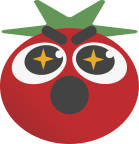

<h1 style="display: flex; align-items: center; gap: 8px;">
  
  POMOMATES
</h1>

O **Pomomates** é um app que atua como um temporizador de foco, com ênfase em tempo de estudo, ajudando a evitar desvios de atenção durante tarefas atuando como um temporizador pomodoro.
Além disso, é onde os usuários compartilham entre si fotos tiradas do seu período de foco em tempo real, dentro de um grupo pré-formado de amigos!

## ✨ Funcionalidades

### ⏱️ Temporizador Pomodoro
Tempos de foco e pausa baseados na técnica Pomodoro para maximizar a sua produtividade nos estudos.

### 👥 Grupos de Amigos
Crie ou entre em grupos para estudar junto com seus amigos.

### 📸 Compartilhamento de fotos
Tire e compartilhe fotos do seu ambiente de estudo com seus amigos do grupo.

### 🏆 Relatório geral de desempenho
Acompanhe seu histórico de sessões e veja sua evolução ao longo do tempo.

### 🎮 Interface gamificada
Experiência visual agradável para tornar o estudo mais engajante.

## 🛠 Tecnologias

### Frontend
- Angular 20
- Ionic Framework 8
- Capacitor 8
- TypeScript
- HTML5
- SCSS

## 📋 Pré-requisitos
O que precisa ser instalado:
- [Node.js](https://nodejs.org/) >= 20.9 (LTS) ou >= 22
- [Angular CLI](https://angular.dev/tools/cli) >= 20 — `npm install -g @angular/cli`
- [Ionic CLI](https://ionicframework.com/docs/cli) >= 7 — `npm install -g @ionic/cli`

## 📦 Instalação

```bash
git clone https://github.com/CaioScura/pomomates.git

cd pomomates

npm install
```

## 🚀 Executando o projeto

```bash
ionic serve
```

Acesse no navegador: `http://localhost:8100/welcome`

## 👨‍💻 Equipe

<table>
  <tr>
    <td align="center">
      <a href="https://github.com/CaioScura">
        
        <br />
        <sub><b>Caio Scura</b></sub>
      </a>
    </td>
    <td align="center">
      <a href="https://github.com/legumignosis">
        
        <br />
        <sub><b>Megumi Akyama</b></sub>
      </a>
    </td>
  </tr>
</table>
